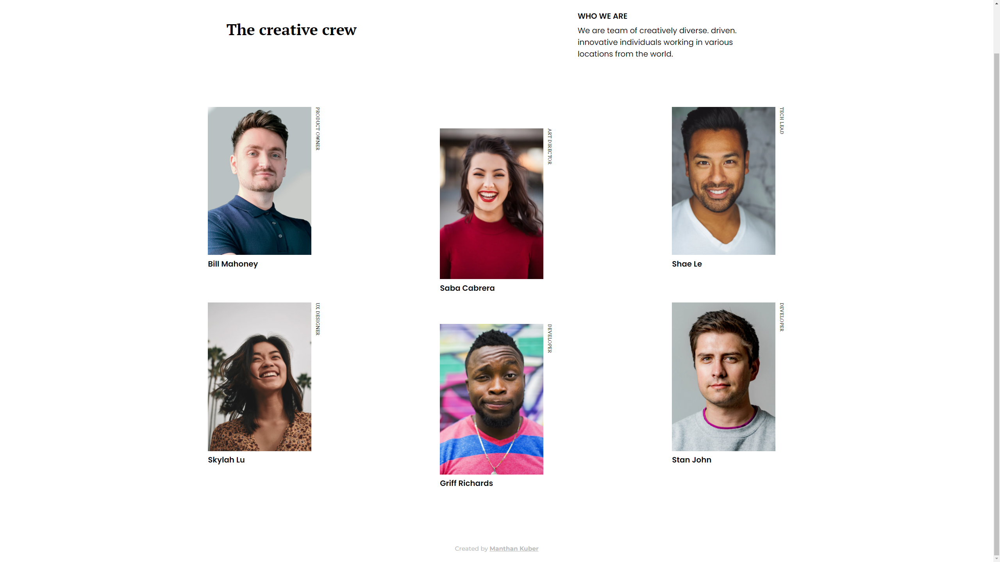
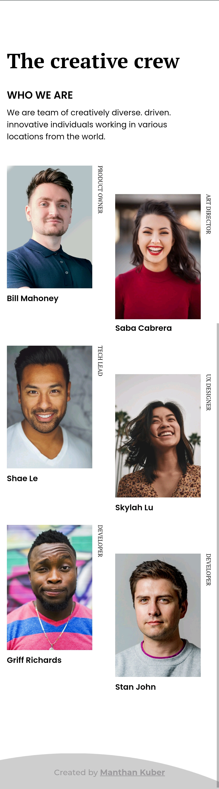

<!-- Please update value in the {}  -->

<h1 align="center">Team Page</h1>

   Solution for a challenge from  <a href="http://devchallenges.io" target="_blank">Devchallenges.io</a>.

  <h3>
    <a href="https://manthan-kuber.github.io/team-page/">
      Live Demo
    </a>
     | 
    
    <a href="https://devchallenges.io/challenges/hhmesazsqgKXrTkYkt0U">
      Challenge
    </a>
  </h3>

<!-- TABLE OF CONTENTS -->

## Table of Contents

- [Screenshots](#screenshots)
- -[Learnings](#learnings)
- [Contact](#contact)

<!-- OVERVIEW -->

## Overview

Desktop Screenshot

Mobile Screenshot

This application/site was created as a submission to a [DevChallenges](https://devchallenges.io/challenges) challenge. The [challenge](https://devchallenges.io/challenges/hhmesazsqgKXrTkYkt0U) was to build an application to complete the given user stories.

## Learnings

- Understood CSS Grid
- Improved knowledge of pseudo selectors
- Learnt good CSS practices (Especially about units in CSS)
- Improved on making layouts 

## Contact

- Website [your-website.com](https://{your-web-site-link})
- GitHub [@your-username](https://{github.com/your-usermame})
- Twitter [@your-twitter](https://{twitter.com/your-username})
